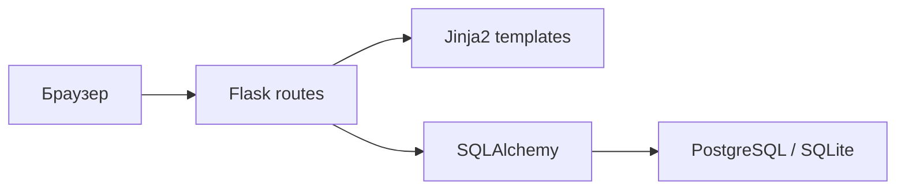
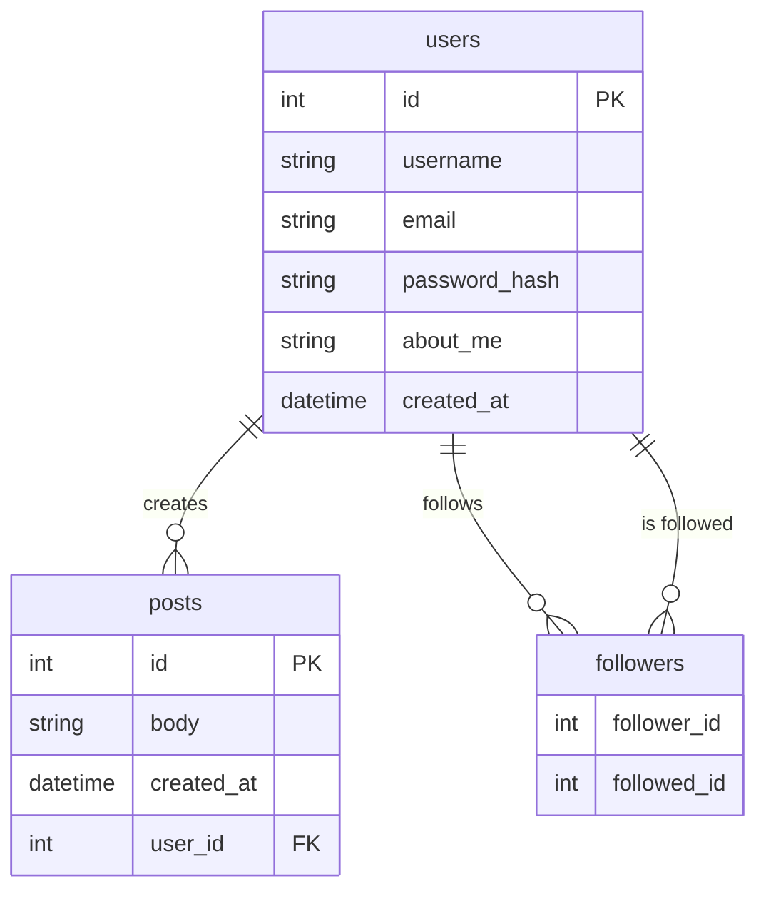

# StudyLog: заметки для отчета по учебной практике

## 1. Краткое описание проекта

StudyLog - это небольшой учебный веб-проект на Python и Flask. По смыслу это микроблог для коротких заметок об учебе. Пользователь может зарегистрироваться, войти в систему, написать заметку, посмотреть общую ленту, открыть профиль другого пользователя и подписаться на него.

Проект сделан в простом формате без лишней сложности. Основная цель - показать базовую веб-разработку на Flask: маршруты, шаблоны, работу с базой данных, авторизацию, формы и деплой.

## 2. Реализованные функции

- регистрация пользователя;
- вход и выход из аккаунта;
- хранение пароля в виде хеша;
- создание коротких заметок;
- личная лента авторизованного пользователя;
- общая лента всех заметок;
- страница профиля пользователя;
- редактирование профиля;
- подписка и отписка от других пользователей;
- пагинация лент и страницы профиля;
- обработка ошибок 404 и 500;
- route `/health` для проверки доступности приложения;
- команда `seed-demo` для создания демо-данных;
- базовые тесты на `pytest`.

## 3. Технический паспорт

- Название проекта: `StudyLog`
- Выбранный проект из каталога Project Based Learning: [Build a Microblog with Flask](https://blog.miguelgrinberg.com/post/the-flask-mega-tutorial-part-i-hello-world)
- GitHub: [https://github.com/shlegeldavid/studylog-flask](https://github.com/shlegeldavid/studylog-flask)
- Деплой: [https://studylog-flask-production.up.railway.app/](https://studylog-flask-production.up.railway.app/)
- Стек: Python, Flask, Jinja2, SQLAlchemy, Flask-Login, Flask-WTF, Flask-Migrate, Gunicorn, Pytest
- База данных: SQLite для локального запуска, PostgreSQL для деплоя
- Наличие авторизации: да, через Flask-Login
- Тестовые данные: `demo / demo123`

## 4. Архитектурная схема

## 5. ERD базы данных

## 6. Use Case

### Регистрация

Пользователь открывает страницу регистрации, вводит имя, email и пароль. После отправки формы создается новый аккаунт, а пароль сохраняется в виде хеша.

### Вход

Пользователь открывает страницу входа, вводит логин и пароль. После успешной проверки попадает в свой аккаунт.

### Создание заметки

После входа пользователь на главной странице вводит текст заметки и публикует ее. Новая заметка появляется в личной ленте.

### Просмотр общей ленты

Любой посетитель может открыть страницу `/feed` и посмотреть заметки всех пользователей в обратном хронологическом порядке.

### Просмотр профиля

Пользователь может открыть страницу профиля, посмотреть описание, количество заметок, подписок и подписчиков.

### Подписка на пользователя

Авторизованный пользователь открывает чужой профиль и нажимает кнопку подписки. После этого заметки этого пользователя попадают в личную ленту.

## 7. Таблица соответствия функций

| Функция | Файл или папка в GitHub | Страница деплоя, где это проверяется |
| --- | --- | --- |
| Регистрация пользователя | `app/auth/routes.py`, `app/auth/forms.py`, `app/templates/auth/register.html` | `/auth/register` |
| Вход и выход | `app/auth/routes.py`, `app/templates/auth/login.html` | `/auth/login` |
| Личная лента и создание заметки | `app/main/routes.py`, `app/main/forms.py`, `app/templates/main/index.html` | `/` после входа |
| Общая лента | `app/main/routes.py`, `app/templates/main/feed.html` | `/feed` |
| Профиль пользователя | `app/main/routes.py`, `app/templates/main/user.html` | `/user/demo`, `/user/alice`, `/user/bob` |
| Подписка на пользователя | `app/main/routes.py`, `app/templates/main/user.html` | `/user/bob` после входа под `demo` |
| Модели базы данных | `app/models.py` | косвенно используется на всех страницах |
| Обработка ошибок | `app/__init__.py`, `app/templates/errors/` | любая несуществующая страница, например `/missing-page` |
| Демо-данные | `app/__init__.py` команда `seed-demo` | вход под `demo / demo123` |

## 8. Краткий сценарий демонстрации до 2 минут

1. Открыть главную страницу проекта и коротко сказать, что это учебный микроблог для заметок.
2. Войти под демо-пользователем: `demo / demo123`.
3. Показать главную страницу авторизованного пользователя и кратко объяснить, что это личная лента подписок.
4. Создать одну короткую заметку и показать, что она сразу появилась в ленте.
5. Перейти в общую ленту `/feed` и показать, что там видны заметки всех пользователей.
6. Открыть профиль `bob` и показать кнопку подписки.
7. Сказать, что данные хранятся в базе, а само приложение развернуто на Railway.

## Короткий вывод

В результате получился понятный учебный Flask-проект с базовой авторизацией, работой с базой данных, лентами заметок, профилями пользователей и деплоем. Проект не перегружен лишними технологиями, поэтому его удобно объяснять на защите и использовать как основу для отчета по практике.
